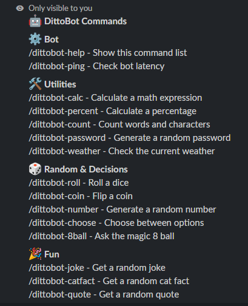

# DittoBot

DittoBot is a 24/7 running SlackBot that I created.

(p.s. Sorry for making you ask for the README so many times. I finally wrote it myself.)


## What is DittoBot?

DittoBot is a Slack bot that I made to /dittobot- choose.
It can /dittobot-calc and /dittobot-8ball.
I made it because I wanted to learn how to build and connect a bot to Slack.

## Commands


## How to Run Locally

Clone the repository:

```bash
git clone https://github.com/d08835149-prog/DittoBot.git
cd DittoBot
```

Install the packages:

```bash
npm install
```

Create a `.env` file with:

```env
SLACK_BOT_TOKEN=your_bot_token
SLACK_APP_TOKEN=your_app_token
```

Then run:

```bash
node index.js
```

## Tech Stack

*Node.js
*JavaScript
*Slack Bolt
*Slack Socket Mode
*systemd

## Project Structure

commands/ ├── calc.js ├── percent.js ├── count.js ├── password.js ├── weather.js ├── roll.js ├── coin.js ├── number.js ├── choose.js ├── 8ball.js ├── joke.js ├── catfact.js └── quote.js

