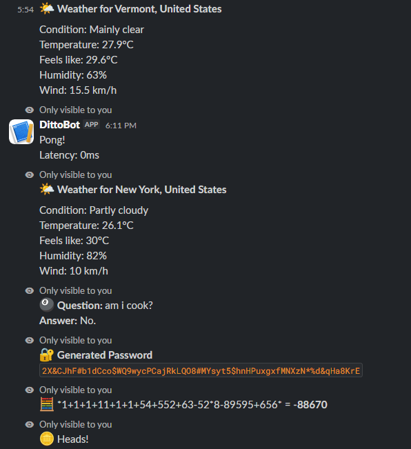

# DittoBot

Before we begin, please note that this README.md uses AI.

It started with one command.

`/dittobot-ping`

That was it.

Then, naturally, I thought, *“What if I add a calculator?”*

And then a random number generator.

And dice.

And a coin flip.

And a Magic 8-Ball.

And weather.

And jokes.

And cat facts.

And suddenly, somehow, I had built **DittoBot**, a Slack bot with **14 different commands** running 24/7 on a Linux server.

## What Can It Do?

Basically, if you need to make a completely unnecessary decision in Slack, DittoBot probably has a command for it.


* `/dittobot-help` — Shows all available commands
* `/dittobot-ping` — Checks bot latency
* `/dittobot-calc` — Calculates expressions
* `/dittobot-percent` — Calculates percentages
* `/dittobot-count` — Counts characters and words
* `/dittobot-password` — Generates a random password
* `/dittobot-weather` — Checks the weather
* `/dittobot-roll` — Rolls dice
* `/dittobot-coin` — Flips a coin
* `/dittobot-number` — Picks a random number
* `/dittobot-choose` — Picks one option from a list
* `/dittobot-8ball` — Answers questions with a Magic 8-Ball
* `/dittobot-joke` — Tells a random joke
* `/dittobot-catfact` — Gives a random cat fact
* `/dittobot-quote` — Gives a random quote

Yes.

There are **15 commands**, not 14.

Apparently I can't count.

## Example



## The Most Important Feature

Obviously, it's `/dittobot-choose`.

Give it a few options:

```text
/dittobot-choose pizza, burger, sushi
```

And DittoBot will make the decision for you:

```text
🎯 I chose the burger!
```

Congratulations. You no longer have to decide what to eat.

## Demo

It can also do slightly more useful things:

```text
/dittobot-calc 25 * 4 + 10

/dittobot-weather Toronto

/dittobot-number 1 100
```

## How It Started

The first version was basically one giant `index.js`.

Every command went into the same file.

It worked.

Then the file passed 300 lines.

At that point, `index.js` started becoming less of a file and more of a cry for help.

So I split everything into separate files inside the `commands` folder.

Much better.

Future me can now understand what past me was doing.

## The Tech Behind It

DittoBot is built with:

* Node.js
* JavaScript
* Slack Bolt
* Slack Socket Mode
* Several APIs
* Linux
* systemd

The Slack tokens are stored in `.env` rather than being committed to GitHub.

```env
SLACK_BOT_TOKEN=your_bot_token
SLACK_APP_TOKEN=your_app_token
```

Which is significantly better than putting them directly into the source code and discovering security a little too late.

## Making It Actually Stay Online

Running a bot on my laptop is easy.

Running a bot **24/7** is a different story.

So I deployed DittoBot to **Nest** and configured it as a `systemd` service.

Now the server starts the bot automatically and keeps it running even when I disconnect.

Which means:

> I can close my laptop, and the bot keeps working.

This is probably the most satisfying part of the entire project.

## The One Bug That Hated Me

During deployment, I discovered that:

```text
/dittobot-ping
```

didn't work.

Everything else was fine.

After investigating, I found the problem.

While refactoring the project into multiple files, I had accidentally deleted the code responsible for the ping command.

So the bot wasn't broken.

I had simply deleted the feature.

After fixing it, `/dittobot-ping` returned to its rightful place.

## What I Actually Learned

This project started as a collection of commands that sounded fun.

But it ended up teaching me quite a lot.

I learned how to:

* Build Slack slash commands
* Work with Slack Bolt
* Organize a growing Node.js project
* Separate features into modules
* Work with APIs
* Manage environment variables
* Run Node.js applications on Linux
* Configure a `systemd` service
* Debug problems caused by refactoring
* Keep a bot running independently from my laptop

The biggest lesson was probably this:

**A project doesn't have to start out complicated to become a real engineering project.**

DittoBot started with:

```text
/dittobot-ping
```

And somehow ended up as a 24/7 Slack bot with a small army of completely unnecessary commands.

Honestly?

Worth it.
